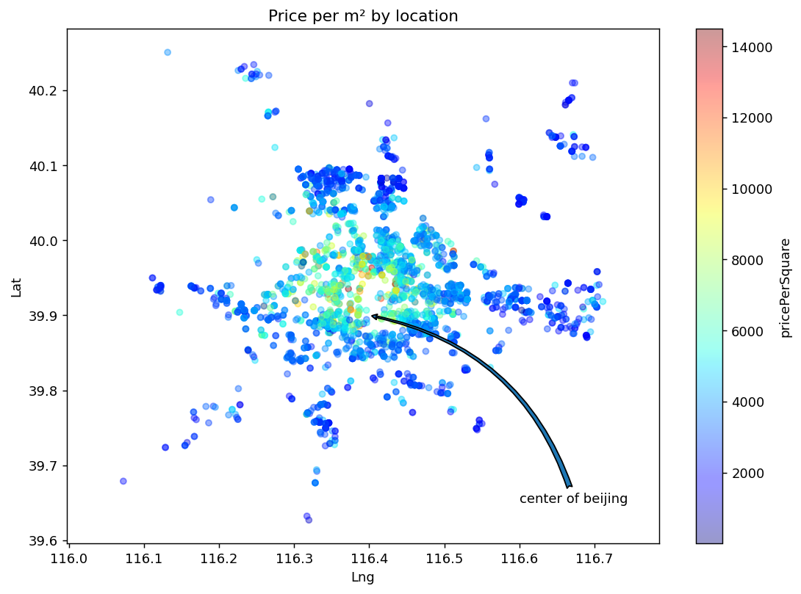
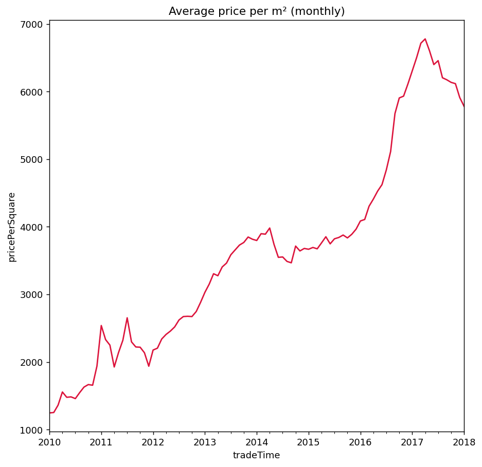
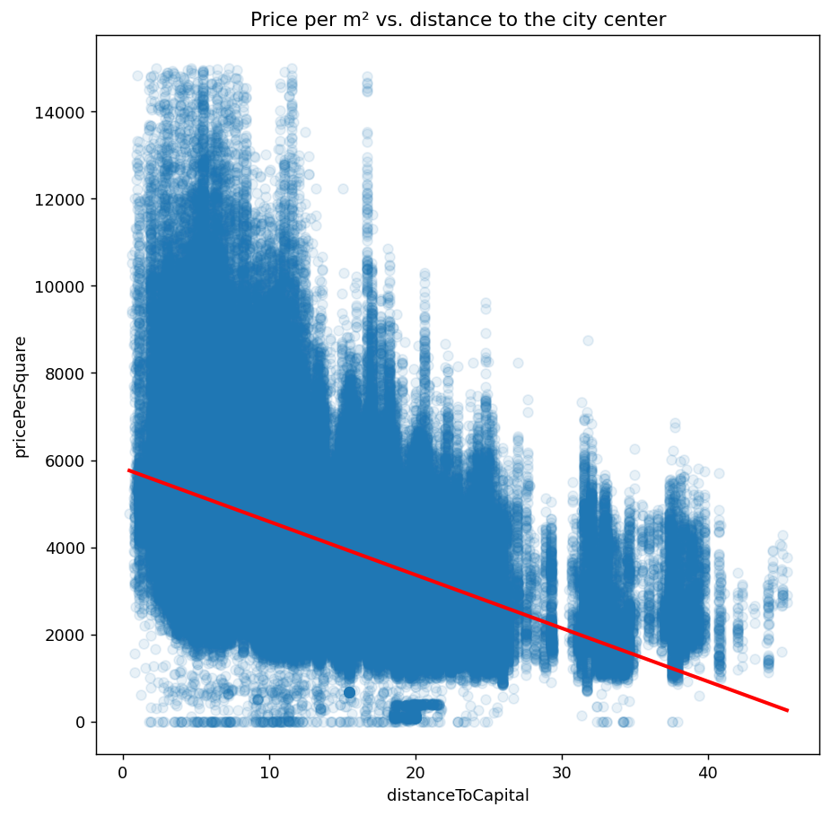
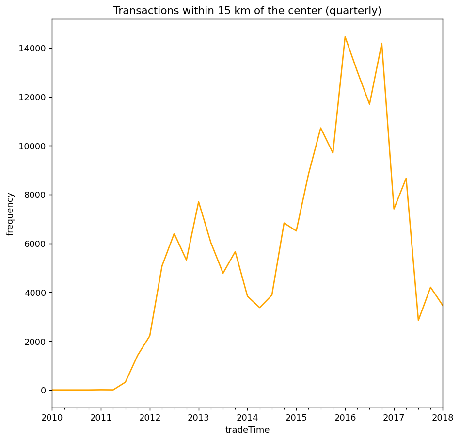

# Beijing Housing Price Analysis

End-to-end exploratory analysis of ~318,000 Beijing housing transactions: data cleaning, feature engineering, geospatial visualization, and time-series analysis with pandas, seaborn and matplotlib.

<p align="center">
  
  
</p>

## Key findings

- **Location drives price.** Price per m² correlates negatively with distance to the center (r = −0.45). The mean falls from ≈5,600 within 5 km to ≈2,700 beyond 30 km.
- **Elevators matter modestly.** Median price per m² is ≈7% higher for properties with an elevator (3,892 vs. 3,635). The effect is confounded by location and building age, so it should not be read as causal.
- **Prices rose sharply, then declined.** The monthly mean grew from ≈1,250 (Jan 2010) to a peak of ≈6,780 (Apr 2017), then fell ≈15% to ≈5,780 by Jan 2018.
- **Central transactions dropped.** Quarterly transactions within 15 km of the center peaked at ≈14,500 around the turn of 2015/16 and fell to roughly 3,000–4,000 in the second half of 2017. Part of this drop may reflect incomplete data for recent months; most records fall between 2011 and 2017.
- **Districts differ widely.** Mean price per m² ranges from ≈2,400 (district 13) to ≈6,500 (district 10).

<p align="center">
  
  
</p>

## Dataset

`data/raw/housing_data.csv.gz` contains one row per transaction (318,851 rows). The file uses `gbk` encoding because several fields contain Chinese text.

| Column | Description |
|---|---|
| `Lng`, `Lat` | Longitude / latitude |
| `tradeTime` | Transaction date |
| `DOM` | Days on market |
| `totalPrice` | Sale price |
| `square` | Floor area |
| `livingRoom`, `drawingRoom`, `kitchen`, `bathRoom` | Room counts |
| `floor` | Floor height category (Chinese label) and floor number |
| `constructionTime` | Year built |
| `renovationCondition`, `buildingStructure` | Coded renovation status / building structure |
| `elevator`, `subway` | Binary flags |
| `district` | District code |

## Pipeline

Run the notebooks in order; each one reads the previous step's output from `data/processed/`.

| # | Notebook | What it does | Rows out |
|---|---|---|---|
| 1 | [`01_missing_values`](notebooks/01_missing_values.ipynb) | Drops identifier columns, imputes `DOM` with its mode (≈50% missing, many outliers), drops rows missing `elevator`/`subway` | 318,819 |
| 2 | [`02_formatting_and_outliers`](notebooks/02_formatting_and_outliers.ipynb) | Decodes categorical codes, fixes `constructionTime` and `floor`, removes `totalPrice` outliers with the 1.5 × IQR rule | 285,040 |
| 3 | [`03_feature_engineering`](notebooks/03_feature_engineering.ipynb) | Adds `distanceToCapital` (great-circle distance to the center) and `pricePerSquare`; histograms, regression plot, elevator density plot | 285,040 |
| 4 | [`04_map_visualization`](notebooks/04_map_visualization.ipynb) | Scatter maps of a 1% sample colored by price or district, sized by distance or area, over satellite imagery | – |
| 5 | [`05_time_series`](notebooks/05_time_series.ipynb) | Per-district summary table; monthly price and quarterly central-transaction trends with `resample` | – |

Cleaning removes 19,283 rows with an unknown construction year (≈6%) and 14,496 price outliers.

## Repository structure

```
.
├── data/
│   ├── raw/                  # input dataset (gzip-compressed CSV)
│   └── processed/            # generated by the notebooks (large files are git-ignored)
├── notebooks/                # run in order: 01 → 05
├── assets/                   # background map images used in notebook 04
├── reports/figures/          # figures exported by the notebooks
├── requirements.txt
└── README.md
```

## Getting started

```bash
git clone https://github.com/kian5426/beijing-housing-analysis.git
cd beijing-housing-analysis
pip install -r requirements.txt
jupyter lab
```

Open the notebooks in `notebooks/` and run them in order. Paths are relative to that folder, and the intermediate CSVs in `data/processed/` are regenerated automatically.

## Notes and limitations

- `pricePerSquare = totalPrice / square × 1000`; the scale factor follows the original assignment specification. Relative comparisons are unaffected.
- Findings are descriptive. Observed relationships (e.g. elevator vs. price) are not controlled for location, age or size.
- Notebook 04 plots only every 100th row to keep outputs light.
- Background map imagery was provided with the course material (Google Maps).

## Tech stack

Python · pandas · NumPy · matplotlib · seaborn · Jupyter
